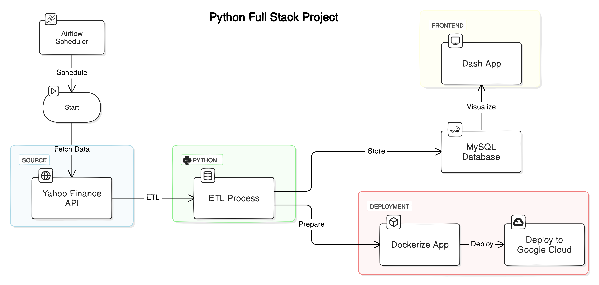
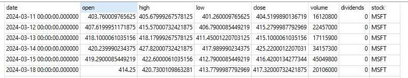
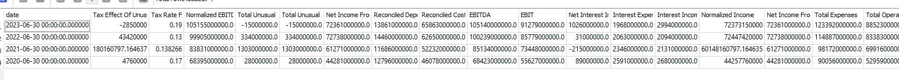
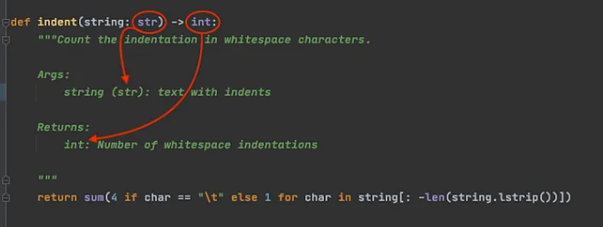
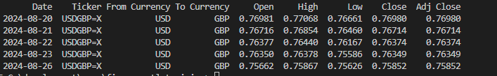
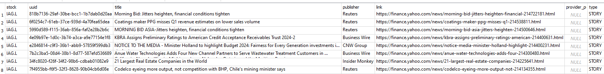

Backend ETL pipeline to process stock data from yahoo finance api

## Architecture diagram



### Task 1
* 1. create main.py, extract_data.py, load_data.py
* 2. create requirments.txt file that has contents below
```
SQLAlchemy==1.4.52
yfinance==0.2.37
pandas>=1.3.0
numpy>=1.21.0
```
* 3. run pip install -r requirements.txt
* 4. familiar yourself with  use yahoo finance api by looking at example here
    [Yahoo finance api example file](./samples/yahoo_finance_api_usage_example.py)
* 4. create two functions in extrac_data.py see below

```python
def get_stock_history(stock):
    '''this function should pull stock history given a stock input,
       please follow this link to get example on how to use yahoo finance api
       https://github.com/ranaroussi/yfinance
    '''


```
it should return a data frame like this below

<!--  -->


```python
def get_stock_financials(stock):
    '''this function should get share holders of a stock given a stock input,
       please follow this link to get example on how to use yahoo finance api
       https://github.com/ranaroussi/yfinance
    '''

```
it should return a data frame like this below




When creating functions, please add type hinting and doc string like below



### Static code analysis tool
- pylint: check your code style, enforces coding standard and make suggestions about how the code could be refactored recommend by PEP8(a python tyle guide) and rate it from 0-10. 💡Interview questions: what is pep 8 （answers:https://realpython.com/python-pep8/#:~:text=PEP%208%2C%20sometimes%20spelled%20PEP8,and%20consistency%20of%20Python%20code.)
- mypy: check data type in your code to make sure no type related errors/bugs
- black: format your code automatically
- isort: sort the libraries import in your project

### Task 2
```python
1. add a function called get_exchange_rate to extract_data.py so it can download fx rate for us
def get_exchange_rate(from_currency, to_currency, interval):


```
and output should look like below




```python
2. add a function called get_stock_currency_code so that we know what currency this stock belongs to
def get_stock_currency_code(stock):
    #hint look attribute in fast_info property

```

```python


3. add function called get_news to extract_data.py so we can get relevant news belongs to that company
def get_news(stock):
```
and output should look like below



### Task 3
1. creat function as below
```python
def enrich_stock_history(stock_history:pd.DataFrame):
    """
    This function adds two columns to stock_history data frame
        a. "daily_return": this is caluclated using the "close" price column, google "how to calcualte daily return pandas"
        b. "cummulative_return": this is caculated using the "daily_return" caculated from step above(see stackoverflow below)
        https://stackoverflow.com/questions/35365545/calculating-cumulative-returns-with-pandas-dataframe
    """
    return stock_history

```
2. create load_data.py file and create function inside like below that save dataframe to sqlite db
     
```python
 def save_df_to_db(
    df, table_name,  engine, if_exists="append", dtype=None,
) -> None:
    """
    Function to send a dataframe to SQL database.

    Args:
        df: DataFrame to be sent to the SQL database.
        table_name: Name of the table in the SQL database.
        engine: db engine type, in our project, this could be sqlite or mysql
        if_exists: Action to take if the table already exists in the SQL database.
                   Options: "fail", "replace", "append" (default: "append").
        dtype: Dictionary of column names and data types to be used when creating the table (default: None).
        

    Returns:
        None. This function logs a note in the log file to confirm that data has been sent to the SQL database.
    """
```

instructions on how to connect to sqlite using python

```python

import sqlite3 #1. import sqlite library(used to interact with sqlite)
from sqlalchemy import create_engine #2. import sqlalchemy library(used for interact with db using pandas)
ENGINE = create_engine(f"sqlite:///<path on your local drive>.db") #3. create engine
df.to_sql() #4. final step of saving dataframe to db, see pandas documents on how to pass the requried parameterss
# https://pandas.pydata.org/docs/reference/api/pandas.DataFrame.to_sql.html

```
3. install sqlite studio from link below
https://github.com/pawelsalawa/sqlitestudio/releases


### Task 4

1. add logging to your project and add different type of logs wherever applicable
https://realpython.com/python-logging/
https://www.youtube.com/watch?v=urrfJgHwIJA 
```python
import logging

logging.basicConfig(format='%(asctime)s - %(message)s', level=logging.INFO)
logging.info('Admin logged in')
```
2. add unit testing(use pytest, see youtube video below) for 2 functions one for get_stock_history and one for get_news
https://www.youtube.com/watch?v=cHYq1MRoyI0&t=716s

3. set up mysql engine and call your project below and you should see data loaded into mysql database
   similar to how you set sqlite db. just change the connection string
```python
    tickers = ["AAPL"]
    period = "5d"
    main(tickers, period=period, db_type="mysql")
```
see video below to setup mysql
https://www.youtube.com/watch?v=u96rVINbAUI

for mac user, you need to run brew install mysql pkg-config
https://stackoverflow.com/questions/66669728/trouble-installing-mysql-client-on-mac

### Task 5 CI pipeline configuration

Configuration file is located in .github\workflows\pylint.yml folder. please add mypy check and unit testing to github workflow so that 
it will run mypy check and unit testing every time we push code to our repo(hint:you can use chatgpt here)
