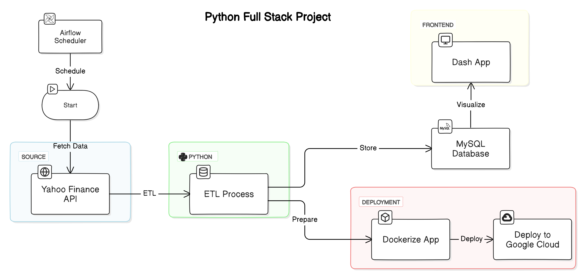
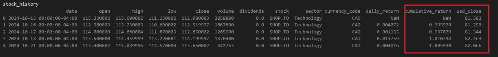

Backend ETL pipeline to process stock data from yahoo finance api

## Architecture diagram



### Task 1
* 1. create main.py, extract_data.py, load_data.py
* 2. create requirments.txt file that has contents below
```
SQLAlchemy==1.4.52
yfinance==0.2.37
pandas>=1.3.0
numpy>=1.21.0
```
* 3. run pip install -r requirements.txt
* 4. familiar yourself with  use yahoo finance api by looking at example here
    [Yahoo finance api example file](./samples/yahoo_finance_api_usage_example.py)
* 4. create two functions in extrac_data.py see below

```python
def get_stock_history(stock):
    '''this function should pull stock history given a stock input,
       please follow this link to get example on how to use yahoo finance api
       https://github.com/ranaroussi/yfinance
    '''


```
it should return a data frame like this below

<!--  -->


```python
def get_stock_financials(stock):
    '''this function should get share holders of a stock given a stock input,
       please follow this link to get example on how to use yahoo finance api
       https://github.com/ranaroussi/yfinance
    '''
    output_columns = [
        "date",
        "Tax Effect Of Unusual Items",
        "Tax Rate For Calcs",
        "Normalized EBITDA",
        "Net Income From Continuing Operation Net Minority Interest",
        "Reconciled Depreciation",
        "Reconciled Cost Of Revenue",
        "EBITDA",
        "EBIT",
        "Net Interest Income",
        "Interest Expense",
        "Interest Income",
        "Normalized Income",
        "Net Income From Continuing And Discontinued Operation",
        "Total Expenses",
        "Total Operating Income As Reported",
        "Diluted Average Shares",
        "Basic Average Shares",
        "Diluted EPS",
        "Basic EPS",
       
    ]

```
it should return a data frame like this below


When creating functions, please add type hinting and doc string like below


### Static code analysis tool
- pylint: check your code style, enforces coding standard and make suggestions about how the code could be refactored recommend by PEP8(a python tyle guide) and rate it from 0-10. 💡Interview questions: what is pep 8 （answers:https://realpython.com/python-pep8/#:~:text=PEP%208%2C%20sometimes%20spelled%20PEP8,and%20consistency%20of%20Python%20code.)
- mypy: check data type in your code to make sure no type related errors/bugs
- black: format your code automatically
- isort: sort the libraries import in your project

### Task 2
```python
1. add a function called get_exchange_rate to extract_data.py so it can download fx rate for us
def get_exchange_rate(from_currency, to_currency, interval):
    fx_rate_ticker = f"{from_currency}{to_currency}=X"
    fx_rates = yf.download(fx_rate_ticker, period=period, interval=interval)


```
and output should look like below


```python
2. add a function called get_stock_currency_code so that we know what currency this stock belongs to
def get_stock_currency_code(stock):
    #hint look attribute in fast_info property

```

```python


3. add function called get_news to extract_data.py so we can get relevant news belongs to that company
def get_news(stock):
```
and output should look like below


4. Add a new python file called transform_data.py and it should round open, high, low, close columns to 2 decimal places
and rename data column to trade_data
```Python
def normalize_stock_data(stock_history: pd.DataFrame) -> pd.DataFrame:

```


### Task 3
1. creat function as below to transform data.py
```python
def add_stock_returns(stock_history:pd.DataFrame):
    """
    This function adds two columns to stock_history data frame
        a. "daily_return": this is caluclated using the "close" price column, google "how to calcualte daily return pandas"
        b. "cummulative_return": this is caculated using the "daily_return" caculated from step above(see stackoverflow below)
        https://stackoverflow.com/questions/35365545/calculating-cumulative-returns-with-pandas-dataframe
    """

```
2. The stock price we get is denominated in local currency and we want to convert it to USD, in order to achieve this, we need
   2.1 add a new column called currency_code(use the function get_stock_currency_code created from task 2 ) to stock history data frame in our get_stock_history function
   2.1 add new function called standardize_price_to_usd like below, this function should first get the fx rate from whatever local currency to usd and then apply it to existing close price column to get a usd_close price column


   note: you can use "SHOP.TO" to test it's the canadian stock ticker for canadian company called SHOPIFY, it should return canadian stock price when we our get_stock_history function runs and we need to get CAD/USD fx rate and convert CAD price 
   to USD price

```python
   def standardize_price_to_usd(stock_history):

```


3. finish calculate_moving_average function so it calculate the moving average of stock close price 
```python

def calculate_moving_average(stock_history: pd.DataFrame, window: int = 5) ->pd.DataFrame:
   
```

4. finish get_top_bottom_days function below so it returns stock history data with top n days and bottom n days

```python
def get_top_bottom_days(stock_history: pd.DataFrame, n: int =5) -> pd.DataFrame:

   
```
5. finish group_by_sector function below so it calculates the average stock close price and volume by each sector

```python
def group_by_sector(stock_history: pd.DataFrame) -> pd.DataFrame:


```


### Task 4 
1. create load_data.py file and create function inside like below that save dataframe to mysql db
     
```python
 def save_df_to_db(
    df, table_name, if_exists="append", dtype=None,
) -> None:
    """
    Function to send a dataframe to SQL database.

    Args:
        df: DataFrame to be sent to the SQL database.
        table_name: Name of the table in the SQL database.
        if_exists: Action to take if the table already exists in the SQL database.
                   Options: "fail", "replace", "append" (default: "append").
        dtype: Dictionary of column names and data types to be used when creating the table (default: None).
        

    Returns:
        None. This function logs a note in the log file to confirm that data has been sent to the SQL database.
    """
```

some helpful code snippet
```python

from sqlalchemy import create_engine #1. import sqlalchemy library(used for interact with db using pandas)
ENGINE = create_engine(f"mysql+mysqlconnector://<user_name>:<pass_word>@localhost/<db_name>") #2. create engine
df.to_sql() #4. final step of saving dataframe to db, see pandas documents on how to pass the requried parameterss
# https://pandas.pydata.org/docs/reference/api/pandas.DataFrame.to_sql.html
```
see video below to setup mysql
https://www.youtube.com/watch?v=u96rVINbAUI

for mac user, you need to run brew install mysql pkg-config
https://stackoverflow.com/questions/66669728/trouble-installing-mysql-client-on-mac


2. now we have our functions in extract_data.py, transform_data.py, load_data.py. it's time to connect them together in main.py module
please add this run_pipeline function to main.py so that it takes a list of tickers to do following things:
 - 2.1 it downloading data from yaohoo finance api by calling get_stock_history,get_stock_financials, get_news
 - 2.2 enrich stock history data using add_stock_returns, standardize_price_to_usd, normalize_stock_data, calculate_moving_average
 - 2.3 save enriched stock history, news data, financial data to "stock_history" , "news", "financial" tables  in mysql database respectively

```python 
def run_pipeline(
    tickers: List[str],
    period: str = "1d",
    interval: str = "1d",
):

```


### Task 5

1. add logging to your project and add different type of logs wherever applicable
https://realpython.com/python-logging/
https://www.youtube.com/watch?v=urrfJgHwIJA 
```python
import logging

logging.basicConfig(format='%(asctime)s - %(message)s', level=logging.INFO)
logging.info('Admin logged in')
```
2. add unit testing(use pytest, see youtube video below) for following functions below

 - add_stock_returns
 - normalize_stock_data
https://www.youtube.com/watch?v=cHYq1MRoyI0&t=716s


### Task 6 dockerize your project and set up airflow

hands-on tutorial created by myself
https://github.com/hgao62/docker_tutorial


docker tutorials- How To Containerize Python Applications
https://www.youtube.com/watch?v=bi0cKgmRuiA

docker  compose tutorial
https://www.youtube.com/watch?v=HG6yIjZapSA&t=1598s

apache airflow in half an hour(only need to watch first 4 videos)
https://www.youtube.com/watch?v=s6PgXq-SO4I&list=PLc2EZr8W2QIAI0cS1nZGNxoLzppb7XbqM


### Task 7 run etl pipeline from airflow inside docker
```
docker-compose up --build
```

### Task 8 deploy project to cloud